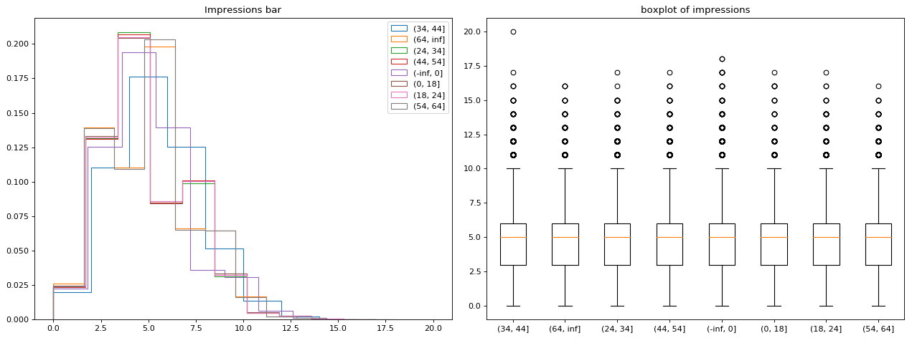
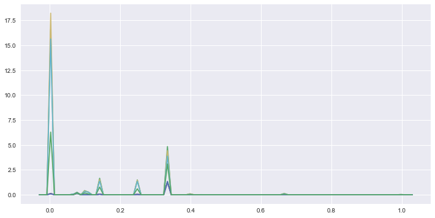

# Python version of codes in doing data science
As doing data science is using R as code example, I would like to try to complete it using python.

## Here is for 2.2.2 Exploratory Data Analysis


```python
import pandas as pd
import numpy as np
import matplotlib.pyplot as plt
%matplotlib inline

import math
```


```python
# Read in data
data1 = pd.read_csv("./data/dds_datasets/dds_ch2_nyt/nyt1.csv")
data1.head()
```


<div>
<table border="1" class="dataframe">
  <thead>
    <tr style="text-align: right;">
      <th></th>
      <th>Age</th>
      <th>Gender</th>
      <th>Impressions</th>
      <th>Clicks</th>
      <th>Signed_In</th>
    </tr>
  </thead>
  <tbody>
    <tr>
      <th>0</th>
      <td>36</td>
      <td>0</td>
      <td>3</td>
      <td>0</td>
      <td>1</td>
    </tr>
    <tr>
      <th>1</th>
      <td>73</td>
      <td>1</td>
      <td>3</td>
      <td>0</td>
      <td>1</td>
    </tr>
    <tr>
      <th>2</th>
      <td>30</td>
      <td>0</td>
      <td>3</td>
      <td>0</td>
      <td>1</td>
    </tr>
    <tr>
      <th>3</th>
      <td>49</td>
      <td>1</td>
      <td>3</td>
      <td>0</td>
      <td>1</td>
    </tr>
    <tr>
      <th>4</th>
      <td>47</td>
      <td>1</td>
      <td>11</td>
      <td>0</td>
      <td>1</td>
    </tr>
  </tbody>
</table>
</div>


```python
# Create column name 'agecat', cataloge age in different chunks.
infinite = -math.inf
finite = math.inf
bin = [infinite, 0, 18, 24, 34, 44, 54, 64, finite]
categoried = pd.cut(data1['Age'], bins=bin)
data1['agecat'] = categoried
data1.head()
```


<div>
<table border="1" class="dataframe">
  <thead>
    <tr style="text-align: right;">
      <th></th>
      <th>Age</th>
      <th>Gender</th>
      <th>Impressions</th>
      <th>Clicks</th>
      <th>Signed_In</th>
      <th>agecat</th>
    </tr>
  </thead>
  <tbody>
    <tr>
      <th>0</th>
      <td>36</td>
      <td>0</td>
      <td>3</td>
      <td>0</td>
      <td>1</td>
      <td>(34, 44]</td>
    </tr>
    <tr>
      <th>1</th>
      <td>73</td>
      <td>1</td>
      <td>3</td>
      <td>0</td>
      <td>1</td>
      <td>(64, inf]</td>
    </tr>
    <tr>
      <th>2</th>
      <td>30</td>
      <td>0</td>
      <td>3</td>
      <td>0</td>
      <td>1</td>
      <td>(24, 34]</td>
    </tr>
    <tr>
      <th>3</th>
      <td>49</td>
      <td>1</td>
      <td>3</td>
      <td>0</td>
      <td>1</td>
      <td>(44, 54]</td>
    </tr>
    <tr>
      <th>4</th>
      <td>47</td>
      <td>1</td>
      <td>11</td>
      <td>0</td>
      <td>1</td>
      <td>(44, 54]</td>
    </tr>
  </tbody>
</table>
</div>


```python
# Get length, min, mean, max
data1[data1.agecat == '(64, inf]'].Age.describe()
```


    count    28753.000000
    mean        72.988697
    std          6.075884
    min         65.000000
    25%         68.000000
    50%         72.000000
    75%         76.000000
    max        108.000000
    Name: Age, dtype: float64


```python
# Plot
fig, axes = plt.subplots(figsize=(16,6),dpi=80, nrows=1, ncols=2)
ax0, ax1 = axes.flatten()

for x in list(categoried.unique()):
    ax0.hist(data1[data1.agecat == x].Impressions, 10, normed=1, histtype='step', stacked=True)
# ax0.hist(data1.Impressions, 10, normed=1, histtype='bar', stacked=True)
ax0.set_title('Impressions bar')
ax0.legend(list(categoried.unique()))

data_to_plot = []
for x in list(categoried.unique()):
    data_to_plot.append(data1[data1.agecat == x].Impressions)
ax1.boxplot(data_to_plot)
ax1.set_xticklabels(list(categoried.unique()))
ax1.set_title('boxplot of impressions')

fig.tight_layout()
plt.show()
```





```python
# Chunk impression into has impression or not
imp_bin = [infinite, 0, finite]
imp_categoried = pd.cut(data1['Impressions'], bins=imp_bin)
data1['hasimps'] = imp_categoried
data1.head()
```


<div>
<table border="1" class="dataframe">
  <thead>
    <tr style="text-align: right;">
      <th></th>
      <th>Age</th>
      <th>Gender</th>
      <th>Impressions</th>
      <th>Clicks</th>
      <th>Signed_In</th>
      <th>agecat</th>
      <th>hasimps</th>
    </tr>
  </thead>
  <tbody>
    <tr>
      <th>0</th>
      <td>36</td>
      <td>0</td>
      <td>3</td>
      <td>0</td>
      <td>1</td>
      <td>(34, 44]</td>
      <td>(0, inf]</td>
    </tr>
    <tr>
      <th>1</th>
      <td>73</td>
      <td>1</td>
      <td>3</td>
      <td>0</td>
      <td>1</td>
      <td>(64, inf]</td>
      <td>(0, inf]</td>
    </tr>
    <tr>
      <th>2</th>
      <td>30</td>
      <td>0</td>
      <td>3</td>
      <td>0</td>
      <td>1</td>
      <td>(24, 34]</td>
      <td>(0, inf]</td>
    </tr>
    <tr>
      <th>3</th>
      <td>49</td>
      <td>1</td>
      <td>3</td>
      <td>0</td>
      <td>1</td>
      <td>(44, 54]</td>
      <td>(0, inf]</td>
    </tr>
    <tr>
      <th>4</th>
      <td>47</td>
      <td>1</td>
      <td>11</td>
      <td>0</td>
      <td>1</td>
      <td>(44, 54]</td>
      <td>(0, inf]</td>
    </tr>
  </tbody>
</table>
</div>


```python
data1[data1.hasimps == '(0, inf]'].Clicks.describe()
```


    count    455375.000000
    mean          0.093218
    std           0.310922
    min           0.000000
    25%           0.000000
    50%           0.000000
    75%           0.000000
    max           4.000000
    Name: Clicks, dtype: float64


```python
# from scipy.stats import gaussian_kde
import seaborn as sns
```


```python
# sns.kdeplot(data1.Clicks / data1.Impressions, bw=0.5)
ctr = []
for x in list(categoried.unique()):
    ctr.append((data1[data1.agecat == x].Clicks / data1[data1.agecat == x].Impressions).fillna(0))
# ctr = data1.Clicks / data1.Impressions
# ctr = ctr.fillna(0)
f, ax = plt.subplots(figsize=(12, 6))
for i in ctr:
    ax = sns.kdeplot(i, bw=0.01)
ax.legend(list(categoried.unique()))
plt.show()
# ctr
```





```python

```
